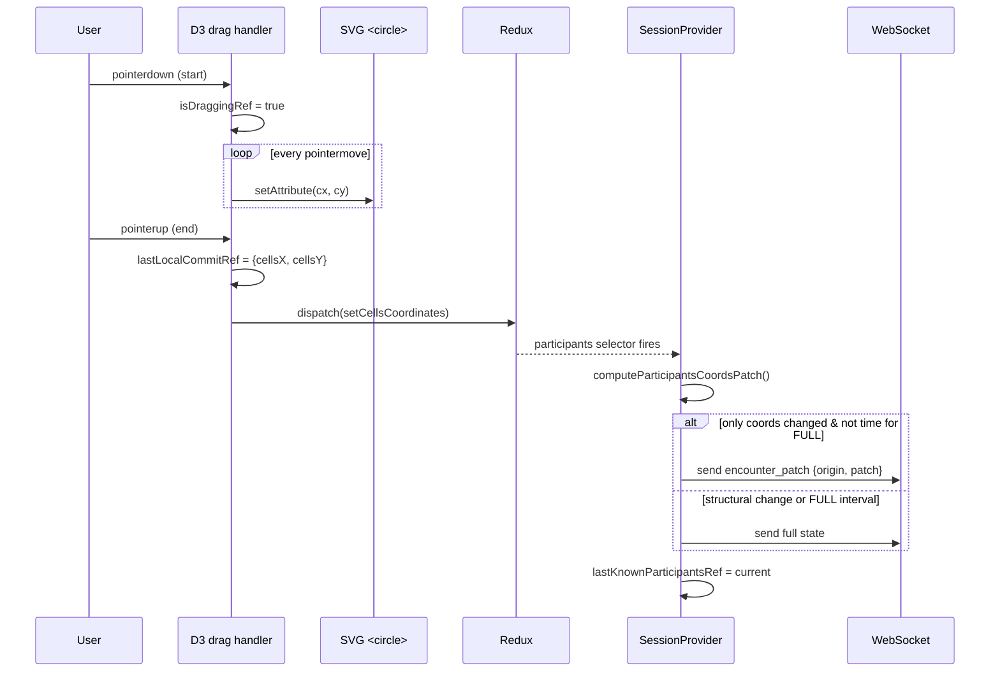
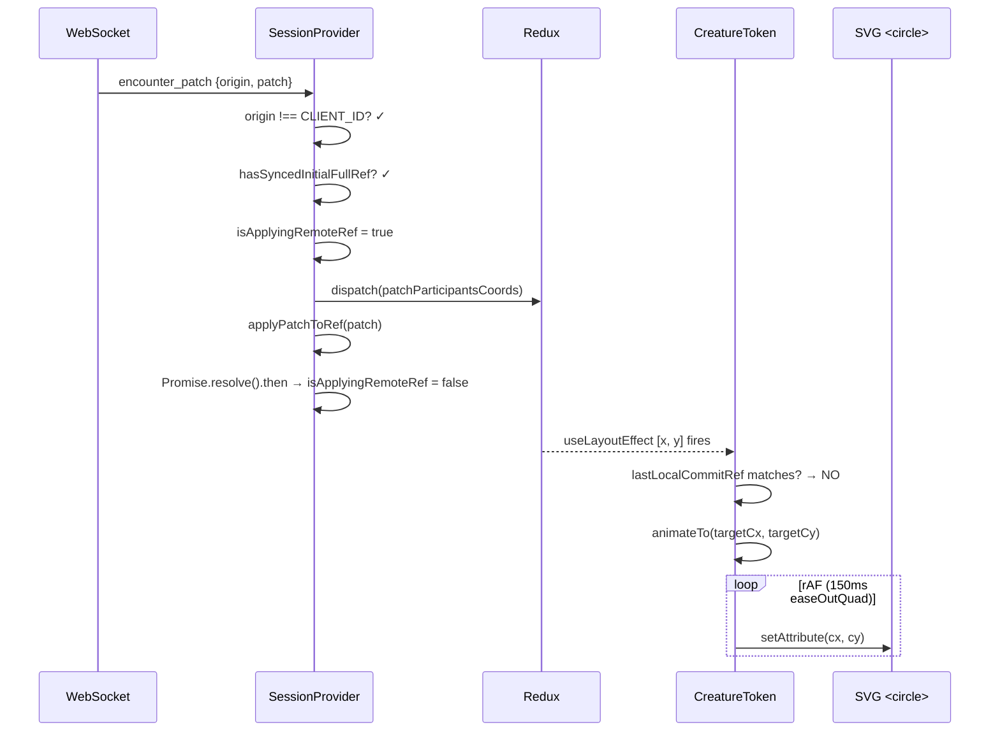
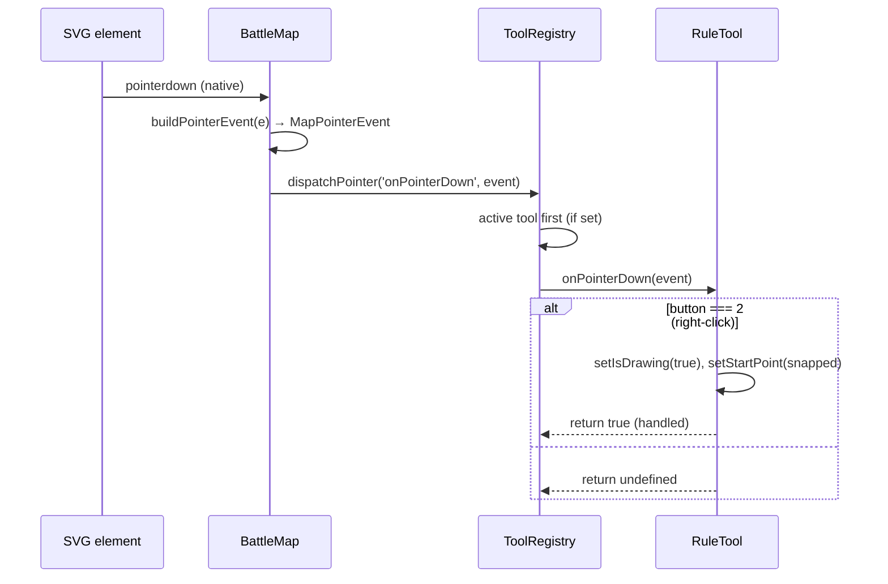

# Encounterium — Architecture Snapshot

> Generated: 2026-01-30
> Scope: BattleMap subsystem (SVG canvas, token management, WebSocket sync, tool system)

---

## 1. Current Architecture Overview

Encounterium follows **Feature-Sliced Design** (FSD): `app → pages → entities → shared`.
The BattleMap is an SVG canvas managed by **D3.js** (zoom/pan/drag) rendered inside React.
Pan uses **ref-based translate** (imperative `setAttribute`, zero re-renders), while zoom triggers
a React state update only when `|Δk| > 1e-6`. Token positions are **purely imperative** — the
main `<circle>` has no declarative `cx`/`cy` props; all positioning goes through `setCirclePosition()`.
Drag is DOM-only during movement; a single Redux dispatch fires on `dragEnd`.
Remote token updates arrive via WebSocket as either **full state** (`battleInfo`) or **coordinate patch**
(`encounter_patch`). Remote moves are smoothly interpolated with a 150 ms easeOutQuad rAF animation.
The **tool system** (ToolRegistry + Tool interface) allows pluggable pointer/keyboard tools
(currently: RuleTool for right-click distance measurement) without touching BattleMap core logic.
Outbound sync uses a 200 ms debounce; coordinate-only changes send a compact PATCH, while
structural changes (initiative, participants list) send the full state.

---

## 2. Invariants

- **No declarative `cx`/`cy` on token `<circle>`** — all positioning is imperative via `setCirclePosition()`.
- **Drag is DOM-only** — during drag, React/Redux are never touched; one `setCellsCoordinates` dispatch on `dragEnd`.
- **Pan never triggers re-render** — translate lives in `translateRef`; only scale lives in `useState`.
- **`lastKnownParticipantsRef` is updated on BOTH outbound send AND inbound remote apply** — prevents echo-loop and stale diffs.
- **`isApplyingRemoteRef` blocks outbound sync** — released on next microtask (`Promise.resolve().then()`), not `setTimeout(0)`.
- **No PATCH before initial FULL** — `hasSyncedInitialFullRef` gate prevents sending/applying patches before the first full state exchange.
- **Anti-echo uses dual protection** — `origin === CLIENT_ID` filter + `isApplyingRemoteRef` flag.
- **Local vs remote detection** — `lastLocalCommitRef` is set before `dispatch` in `dragEnd`; if coord-change effect sees a match, it snaps instead of animating.
- **Tool handlers return `true` to consume events** — propagation stops; other tools don't receive the event.
- **ToolRegistry is a plain class in a `useRef`** — not React state; tool registration doesn't cause re-renders.
- **`syncTimerRef`-based debounce** — the sync function is a stable `useCallback`, not a recreated closure.
- **Full state is resent every 10 s** (`FULL_STATE_INTERVAL_MS`) — guarantees convergence even if patches are lost.

---

## 3. Key Modules

### `shared/lib/`

| File | Purpose |
|------|---------|
| `mapCoords.ts` | `screenToWorld()` — screen→SVG via `getScreenCTM().inverse()`, then inverse d3 transform. `snapToGrid()` — snap world coords to cell center. |
| `battleMapEventBus.ts` | Typed event bus with priority-sorted handlers and "handled" stop pattern. Types: `MapPointerEvent`, `MapKeyEvent`. |
| `computeParticipantsCoordsPatch.ts` | `computeParticipantsCoordsPatch(prev, next)` → `CoordsPatch \| null`. `isOnlyCoordsChange()` — checks if only coords differ (same length, same IDs, same non-coord fields). |

### `entities/encounter/model/`

| File | Purpose |
|------|---------|
| `encounter.slice.ts` | Redux Toolkit slice. Key actions: `setCellsCoordinates` (local drag), `patchParticipantsCoords` (remote PATCH — does NOT bump `saveVersionHash`), `setState` (full remote state). |

### `pages/encounterTracker/ui/battleMap/`

| File | Purpose |
|------|---------|
| `BattleMap.tsx` | SVG canvas root. D3 zoom/pan setup, ref-based translate, tool system wiring (addEventListener on SVG → ToolRegistry dispatch), `buildPointerEvent()` for screen→world conversion. |
| `creatureToken/CreatureToken.tsx` | Token component. Imperative positioning, D3 drag (DOM-only), rAF interpolation for remote moves, attack overlay rendering. |
| `tools/Tool.ts` | `Tool` interface — `id`, optional `cursor`, pointer/key handlers returning `boolean \| void`, optional `renderOverlay`. |
| `tools/ToolRegistry.ts` | `ToolRegistry` class — register/unregister, active tool priority, `dispatchPointer`/`dispatchKey`, `getCursor`. |
| `tools/useRuleTool.tsx` | Hook creating RuleTool — right-click drag measurement. Returns `{ tool, overlay }`. Overlay: dashed SVG line + arrowhead + foreignObject tooltip (distance in Ft). |

### `app/providers/`

| File | Purpose |
|------|---------|
| `encounterTrackerSessionProvider.tsx` | WebSocket lifecycle. Handles `battleInfo` (full state), `encounter_patch` (coords diff). Outbound sync: 200 ms debounce, PATCH vs FULL decision, anti-echo, patch-before-full gate. |

---

## 4. Data Flow

### 4.1 Local Token Drag

### 4.2 Remote Token Update

### 4.3 Tool Event Dispatch

---

## 5. Extension Points

1. **New tools** — implement `Tool` interface, call `registry.register(tool)` in `BattleMap.tsx`. No changes to ToolRegistry needed. Tools can provide `cursor`, overlay via `renderOverlay()` or returned ReactNode.

2. **New WebSocket message types** — add type to `SessionMessage.type` union in `entities/session/model/types.ts`, add handler case in `encounterTrackerSessionProvider.tsx`.

3. **New token overlays** — attack overlay pattern in `CreatureToken.tsx` uses declarative SVG elements bound to Redux state (separate from imperative circle positioning).

4. **Grid variants** — `GridLayout` accepts `cols`, `rows`, `cellSize` — hex grid could be added by swapping the layout component and adjusting `snapToGrid()`.

5. **Participant non-coord fields in PATCH** — extend `CoordsPatch` type and `computeParticipantsCoordsPatch()` to include HP, conditions, etc. for partial sync of other fields.

---

## 6. Known Risks / TODO

| # | Risk / TODO | Severity | Notes |
|---|-------------|----------|-------|
| 1 | **`isOnlyCoordsChange` checks only `_id` and `initiative`** — any new participant field (e.g. conditions, temp HP) added without updating the function will be silently sent as PATCH instead of FULL. | Medium | Keep the field list in sync with `Participant` type. |
| 2 | **`Participant.find()` inside `computeParticipantsCoordsPatch` is O(n²)** — fine for 10–30 participants, but will degrade with hundreds. | Low | Build a Map if needed. |
| 3 | **`BattleMapEventBus` class exists but is unused** — ToolRegistry dispatches events directly, not through the event bus. The bus was created for potential future use. | Low | Remove or integrate; dead code may confuse contributors. |
| 4 | **No server-side conflict resolution for PATCH** — if two clients drag the same token simultaneously, last-write-wins. Periodic FULL resync (10 s) limits divergence. | Medium | Consider per-token version counter or OT for high-concurrency sessions. |
| 5 | **`useRuleTool` foreignObject tooltip has fixed `width='70' height='100'`** — may clip long distance strings at extreme zoom levels. | Low | Scale or auto-size. |
| 6 | **`CreatureToken` calls `circle.call(dragHandler)` on every render** — D3 re-binds listeners each time. Works correctly but is wasteful. | Low | Wrap in `useEffect` with stable drag ref. |
| 7 | **Attack overlay `<circle>` uses declarative `cx`/`cy` bound to `x * cellSize + radius`** — this is intentional (overlay follows Redux state, not drag), but creates a visual disconnect during drag if the attack mode is active. | Low | Consider hiding overlay during drag. |
| 8 | **`screenToWorld` relies on `getScreenCTM()`** — returns `null` in detached or hidden SVG. Fallback is `{x:0, y:0}`. | Low | Could surface an error in dev mode. |
